<!-- ╔══════════════════════════════════════════════════════════════╗ -->
<!-- ║  README.md for github.com/Justinvcj/Justinvcj              ║ -->
<!-- ║  Dark/Light mode responsive • Custom animated SVGs          ║ -->
<!-- ║  Terminal-themed sections • Zero clutter philosophy          ║ -->
<!-- ╚══════════════════════════════════════════════════════════════╝ -->

<!-- HEADER: Dark/Light mode animated SVG banner -->
<picture>
  <source media="(prefers-color-scheme: dark)" srcset="assets/header-dark.svg">
  <source media="(prefers-color-scheme: light)" srcset="assets/header-light.svg">
  
</picture>

<div align="center">

[](https://justinvcj.me)&nbsp;&nbsp;
[](https://linkedin.com/in/justinvcj)&nbsp;&nbsp;
[](mailto:justinvcj@gmail.com)&nbsp;&nbsp;
[](https://leetcode.com/u/Justinvcj/)

</div>

<br>

<!-- ════════════════════════════════════════════════════════════ -->

## `> whoami`


```yaml
name      : Justin Varghese
education : B.E. Computer Science & Engineering
university: Dr. N.G.P Institute of Technology
cgpa      : "8.5"  # <!-- UPDATE THIS -->
location  : Coimbatore, India

currently:
  building  : Production-grade distributed systems
  exploring : System design, LLM integration, event-driven arch
  shipping  : Backend-first full stack applications

principles:
  - Ship it, then polish it
  - Complexity is the enemy
  - If it scales, it stays
```

<br clear="right"/>

<!-- ════════════════════════════════════════════════════════════ -->

## `> cat tech_stack.md`

<!-- TECH STACK: Dark/Light mode animated skill bars -->
<picture>
  <source media="(prefers-color-scheme: dark)" srcset="assets/tech-dark.svg">
  <source media="(prefers-color-scheme: light)" srcset="assets/tech-light.svg">
  
</picture>

<details>
<summary><code>extras —— tools, platforms, concepts</code></summary>
<br>

| Category | |
|:---|:---|
| **DevOps & Tools** | Git · GitHub · Postman · Vercel · VS Code · Linux |
| **Architecture** | Event-Driven · REST · WebSockets · Microservices · OSRM |
| **Core CS** | DSA · OOP · System Design · ETL Pipelines · Concurrency |
| **Databases** | PostgreSQL · SQLite · Supabase · Room DB |

</details>

<!-- ════════════════════════════════════════════════════════════ -->

## `> ls projects/`

<table>
<tr>
<td width="50%" valign="top">

###  Equinox
**Production-Grade Ride-Hailing Ecosystem**

Architected an event-driven backend with **real-time dispatch** via WebSockets, dynamic fare calculation through OSRM, and a cross-platform Flutter client handling live driver tracking.

`Node.js` `WebSockets` `Supabase` `PostgreSQL` `Flutter` `OSRM`

<!-- <a href="https://github.com/Justinvcj/REPO_NAME">

</a> -->

</td>
<td width="50%" valign="top">

###  Developer Knowledge Engine
**AI Knowledge Graph Pipeline**

Automated ETL pipeline that processes unstructured markdown into a queryable, interactive knowledge graph using LLMs and NetworkX for relationship extraction.

`Python` `OpenAI` `NetworkX` `SQLite` `GitHub API` `Pydantic`

<!-- <a href="https://github.com/Justinvcj/REPO_NAME">

</a> -->

</td>
</tr>

<tr>
<td width="50%" valign="top">

###  RepoRoast
**AI-Powered Code Review System**

Full-stack code analysis platform with a static analysis engine, intelligent token budget allocation, and diff-aware incremental reviews — scores repos from 0–100.

`React` `TypeScript` `Node.js` `Gemini API`

<!-- <a href="https://github.com/Justinvcj/REPO_NAME">

</a> -->

</td>
<td width="50%" valign="top">

###  Intent Pay
**Intelligent Expense Management**

Offline-first Android app that parses bank SMS alerts via Broadcast Receivers, classifies transactions with a rule engine, and surfaces spending patterns through an interactive reflection overlay.

`Kotlin` `Jetpack Compose` `Room DB`

<!-- <a href="https://github.com/Justinvcj/REPO_NAME">

</a> -->

</td>
</tr>
</table>

<!--
  ┌─────────────────────────────────────────────────┐
  │  ADD MORE PROJECTS: Copy a <td> block above,    │
  │  update the emoji, title, description & stack.  │
  │  Uncomment the "View Repo" badge and replace    │
  │  REPO_NAME with the actual repository name.     │
  └─────────────────────────────────────────────────┘
-->

<!-- ════════════════════════════════════════════════════════════ -->

## `> work --history`

```
┌──────────────────────────────────────────────────────────────┐
│                                                              │
│  Software Development Intern                                 │
│  Nxtlogic Software Solutions · Coimbatore                    │
│  May 2024 — Jul 2024                                         │
│                                                              │
│  ▸ Engineered 10+ scalable RESTful APIs using Node.js        │
│  ▸ Boosted team velocity 20% via modular refactoring         │
│                                                              │
└──────────────────────────────────────────────────────────────┘
```

<!-- ════════════════════════════════════════════════════════════ -->

## `> git log --graph`

<div align="center">

<!-- Stats + Streak -->
<a href="https://github.com/Justinvcj">
  <picture>
    <source media="(prefers-color-scheme: dark)" srcset="https://github-readme-stats.vercel.app/api?username=Justinvcj&show_icons=true&theme=github_dark&hide_border=true&bg_color=00000000&title_color=58a6ff&icon_color=58a6ff&text_color=c9d1d9&count_private=true&include_all_commits=true">
    <source media="(prefers-color-scheme: light)" srcset="https://github-readme-stats.vercel.app/api?username=Justinvcj&show_icons=true&theme=default&hide_border=true&bg_color=00000000&title_color=0969da&icon_color=0969da&count_private=true&include_all_commits=true">
    
  </picture>
</a>
&nbsp;&nbsp;
<a href="https://github.com/Justinvcj">
  <picture>
    <source media="(prefers-color-scheme: dark)" srcset="https://streak-stats.demolab.com?user=Justinvcj&theme=github-dark-blue&hide_border=true&background=00000000&stroke=30363d&ring=58a6ff&fire=58a6ff&currStreakLabel=58a6ff">
    <source media="(prefers-color-scheme: light)" srcset="https://streak-stats.demolab.com?user=Justinvcj&theme=default&hide_border=true&background=00000000&ring=0969da&fire=0969da&currStreakLabel=0969da">
    
  </picture>
</a>

<br><br>

<!-- Trophies -->
<picture>
  <source media="(prefers-color-scheme: dark)" srcset="https://github-profile-trophy.vercel.app/?username=Justinvcj&theme=darkhub&no-bg=true&no-frame=true&column=7&margin-w=8">
  <source media="(prefers-color-scheme: light)" srcset="https://github-profile-trophy.vercel.app/?username=Justinvcj&theme=flat&no-bg=true&no-frame=true&column=7&margin-w=8">
  
</picture>

<br><br>

<!-- Activity Graph -->
<picture>
  <source media="(prefers-color-scheme: dark)" srcset="https://github-readme-activity-graph.vercel.app/graph?username=Justinvcj&bg_color=00000000&color=58a6ff&line=58a6ff&point=ffffff&area=true&hide_border=true&custom_title=Contribution%20Timeline">
  <source media="(prefers-color-scheme: light)" srcset="https://github-readme-activity-graph.vercel.app/graph?username=Justinvcj&bg_color=00000000&color=0969da&line=0969da&point=1f2328&area=true&hide_border=true&custom_title=Contribution%20Timeline&area_color=0969da">
  
</picture>

</div>

<!-- ════════════════════════════════════════════════════════════ -->

## `> leetcode --stats`

<div align="center">

<picture>
  <source media="(prefers-color-scheme: dark)" srcset="https://leetcard.jacoblin.cool/Justinvcj?theme=dark&font=Fira%20Code&ext=activity&border=0&radius=8">
  <source media="(prefers-color-scheme: light)" srcset="https://leetcard.jacoblin.cool/Justinvcj?theme=light&font=Fira%20Code&ext=activity&border=0&radius=8">
  
</picture>

</div>

<!-- ════════════════════════════════════════════════════════════ -->

## `> cat achievements.log`

<table>
<tr>
<td align="center" width="25%">
<br>
<b>Winner</b><br>
<sub>Intra-college<br>Idea Presentation</sub>
</td>
<td align="center" width="25%">
<br>
<b>Paper Presenter</b><br>
<sub>Technical Paper @<br>Hindusthan College</sub>
</td>
<td align="center" width="25%">
<br>
<b>Hackathon Veteran</b><br>
<sub>24hr KPR Institute +<br>36hr Cybersecurity</sub>
</td>
<td align="center" width="25%">
<br>
<b>Leadership</b><br>
<sub>Pupil Leader ·<br>NSS &amp; JRC Captain</sub>
</td>
</tr>
</table>

<!-- ════════════════════════════════════════════════════════════ -->

<!-- CONTRIBUTION SNAKE -->
<!--
  ┌─────────────────────────────────────────────────────────┐
  │  SETUP (one-time, ~2 mins):                             │
  │                                                         │
  │  1. In your Justinvcj/Justinvcj repo, create:          │
  │     .github/workflows/snake.yml                         │
  │                                                         │
  │  2. Paste:                                              │
  │     name: Generate Snake                                │
  │     on:                                                 │
  │       schedule:                                         │
  │         - cron: "0 0 * * *"                             │
  │       workflow_dispatch:                                │
  │     jobs:                                               │
  │       build:                                            │
  │         runs-on: ubuntu-latest                          │
  │         steps:                                          │
  │           - uses: Platane/snk/svg-only@v3               │
  │             with:                                       │
  │               github_user_name: Justinvcj               │
  │               outputs: |                                │
  │                 dist/dark.svg?palette=github-dark        │
  │                 dist/light.svg?palette=github            │
  │           - uses: crazy-max/ghaction-github-pages@v3     │
  │             with:                                       │
  │               target_branch: output                     │
  │               build_dir: dist                           │
  │                                                         │
  │  3. Go to Actions tab → Run the workflow manually once  │
  │  4. Uncomment the section below                         │
  └─────────────────────────────────────────────────────────┘
-->

<!--
<div align="center">

## `> watch contributions`

<picture>
  <source media="(prefers-color-scheme: dark)" srcset="https://raw.githubusercontent.com/Justinvcj/Justinvcj/output/dark.svg">
  <source media="(prefers-color-scheme: light)" srcset="https://raw.githubusercontent.com/Justinvcj/Justinvcj/output/light.svg">
  
</picture>

</div>
-->

<!-- ════════════════════════════════════════════════════════════ -->

<br>

<div align="center">


<sub>

```
Built with patience, caffeine, and an unreasonable number of git commits.
```

</sub>

</div>

<!-- EOF -->
